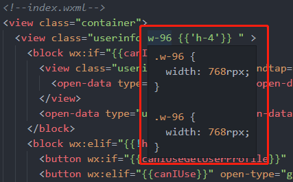

# 原生小程序的使用方法

先上一个笔者配置好的项目: 我的 `fork` 版本 [sonofmagic/MyMina](https://github.com/sonofmagic/MyMina)

[sonofmagic/MyMina](https://github.com/sonofmagic/MyMina) 和原版的 [`listenzz/MyMina`](https://github.com/listenzz/MyMina) 的不同点

- 摒弃了 `node-sass`，改用了 `dart-sass`
- 摒弃了 `moment`，改用了 `dayjs`
- 添加了 `postcss8` 和 `tailwindcss` 支持

## 当然您有旧有的项目迁移，也可以查看下面几步

这里我们使用的 [`listenzz/MyMina`](https://github.com/listenzz/MyMina) 这个原生微信小程序 `webpack`模板，把 `webpack5` 引入进来。

## 1.安装

```bash
yarn add -D weapp-tailwindcss-webpack-plugin postcss-rem-to-responsive-pixel tailwindcss postcss postcss-loader autoprefixer
```

## 2. 创建 `postcss.config.js` 和 `tailwind.config.js`

```js
// postcss.config.js
module.exports = {
  plugins: {
    tailwindcss: {},
    autoprefixer: {},
    'postcss-rem-to-responsive-pixel': {
      rootValue: 32,
      propList: ['*'],
      transformUnit: 'rpx'
    }
  }
}
```

```js
//tailwind.config.js
module.exports = {
  content: ['./src/**/*.{wxml,js,ts}'],
  theme: {
    extend: {}
  },
  plugins: [],
  corePlugins: {
    preflight: false
  }
}
```

## 3. 创建全局样式文件 `src/app.scss`

```scss
@import 'tailwindcss/base';
@import 'tailwindcss/utilities';
```

## 4. 在 `webpack.config.js` 添加 `postcss-loader`，并使用此插件

### 添加 `postcss-loader`

```js
// webpack.config.js
  module: {
    rules: [
      // ....
      {
        test: /\.(scss)$/,
        include: /src/,
        use: [
          {
            loader: 'file-loader',
            options: {
              useRelativePath: true,
              name: '[path][name].wxss',
              context: resolve('src'),
            },
          },
          {
            // 只需要在使用 `sass-loader` 的代码上部
            // 加上这一个 `postcss-loader`
            loader: "postcss-loader"
          },
          {
            loader: 'sass-loader',
            options: {
              sassOptions: { includePaths: [resolve('src', 'styles'), resolve('src')] },
            },
          },
        ],
      },
    ],
  },
```

### 添加插件

```js
// webpack.config.js
const { NativeWeappTailwindcssWebpackPluginV5 } = require('weapp-tailwindcss-webpack-plugin ')

// 插件们
  plugins: [
    new CleanWebpackPlugin({
      cleanStaleWebpackAssets: false,
    }),
    new CopyWebpackPlugin({
      patterns: [
        {
          from: '**/*',
          to: './',
          filter: resourcePath => !['.ts', '.js', '.scss'].some(item => resourcePath.endsWith(item)),
        },
      ],
    }),
    new MinaWebpackPlugin({
      scriptExtensions: ['.ts', '.js'],
      assetExtensions: ['.scss'],
    }),
    new MinaRuntimePlugin(),
    new LodashWebpackPlugin(),
    new webpack.EnvironmentPlugin({
      NODE_ENV: JSON.stringify(process.env.NODE_ENV) || 'development',
      BUILD_TYPE: JSON.stringify(process.env.BUILD_TYPE) || 'debug',
    }),
    // 引入插件
    new NativeWeappTailwindcssWebpackPluginV5()
  ],
```

现在，您就可以在原生小程序中使用 `tailwindcss jit` 的大部分特性了！

## vscode tailwindcss 智能提示设置

我们知道 `tailwindcss` 最佳实践，是要结合 `vscode`/`webstorm`提示插件一起使用的。

假如你遇到了，在 `vscode` 的 `wxml` 文件中，编写 `class` 没有出智能提示的情况，可以参考以下步骤。

这里我们以 `vscode` 为例:

1. 安装 [`WXML - Language Services 插件`](https://marketplace.visualstudio.com/items?itemName=qiu8310.minapp-vscode)(一搜 wxml 下载量最多的就是了)

2. 安装 [`Tailwind CSS IntelliSense 插件`](https://marketplace.visualstudio.com/items?itemName=bradlc.vscode-tailwindcss)

接着找到 `Tailwind CSS IntelliSense` 的 `扩展设置`

在 `include languages`,手动标记 `wxml` 的类型为 `html`

> 假如您看不见图，可以访问国内的知乎页面，我的文章 [增强原生小程序开发，构建 tailwind + postcss + scss 最小化工具链](https://zhuanlan.zhihu.com/p/405571972) 中的 `3. IDE智能提示设置` 中有提及这种方式。


智能提示就出来了:



