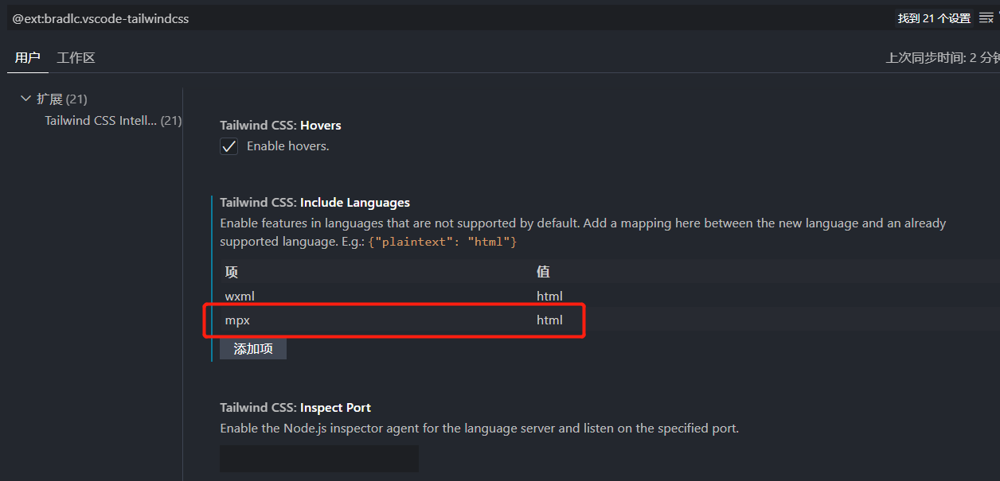

# mpx (原生增强)

在 `vue.config.js` 中注册：

```js title="vue.config.js"
const { defineConfig } = require('@vue/cli-service')
const { UnifiedWebpackPluginV5 } = require('weapp-tailwindcss/webpack')

module.exports = defineConfig({
  // other options
  configureWebpack(config) {
    config.plugins.push(new UnifiedWebpackPluginV5({
      appType: 'mpx'
    }))
  }
})

```

## mpx 中的 vscode tailwindcss 智能提示缺失设置

我们知道 `tailwindcss` 最佳实践，是要结合 `vscode`/`webstorm`提示插件一起使用的。

假如你遇到了，在 `vscode` 的 `mpx` 文件中，编写 `class` 没有出智能提示的情况，可以参考以下步骤。

这里我们以 `vscode` 为例:

接着找到 `Tailwind CSS IntelliSense` 的 `扩展设置`

在 `include languages`,手动标记 `mpx` 的类型为 `html`



保存设置，再去`mpx`文件里写`class`的时候，智能提示就出来啦。
